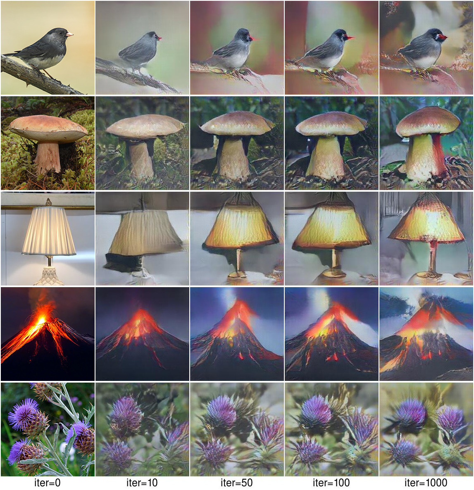
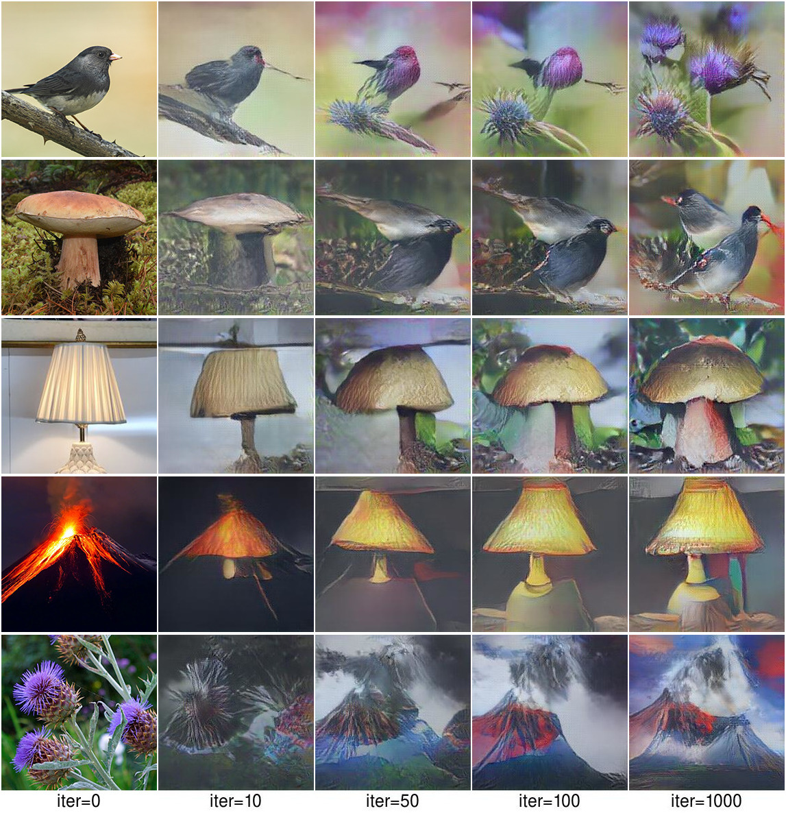
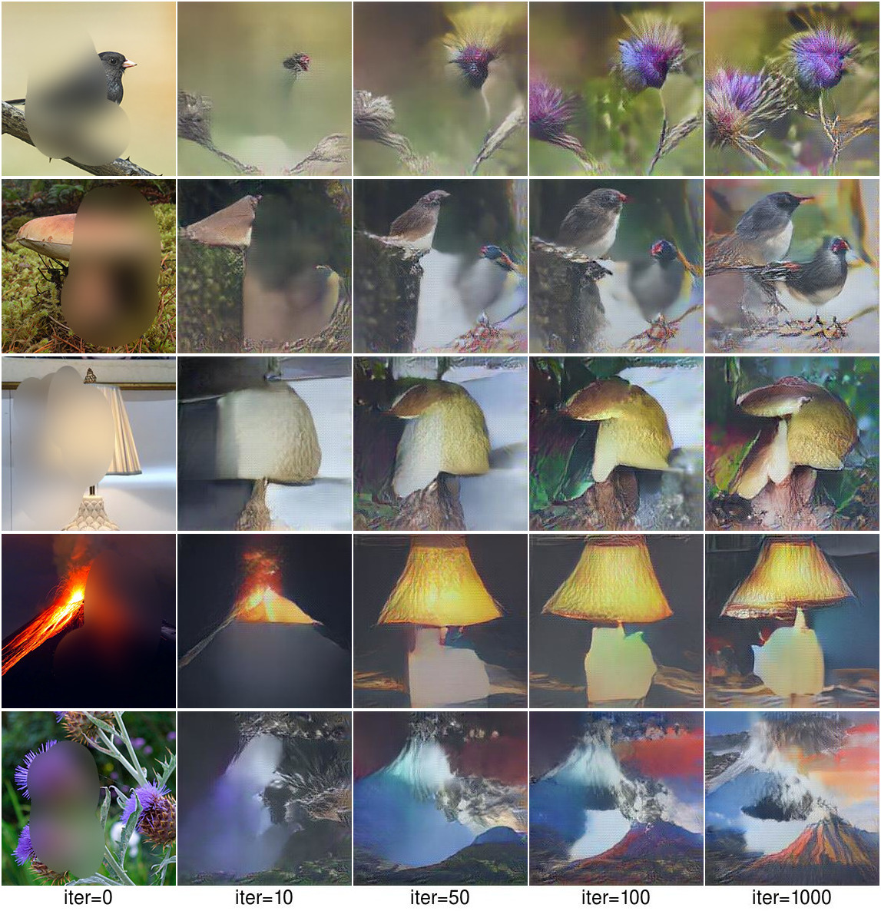
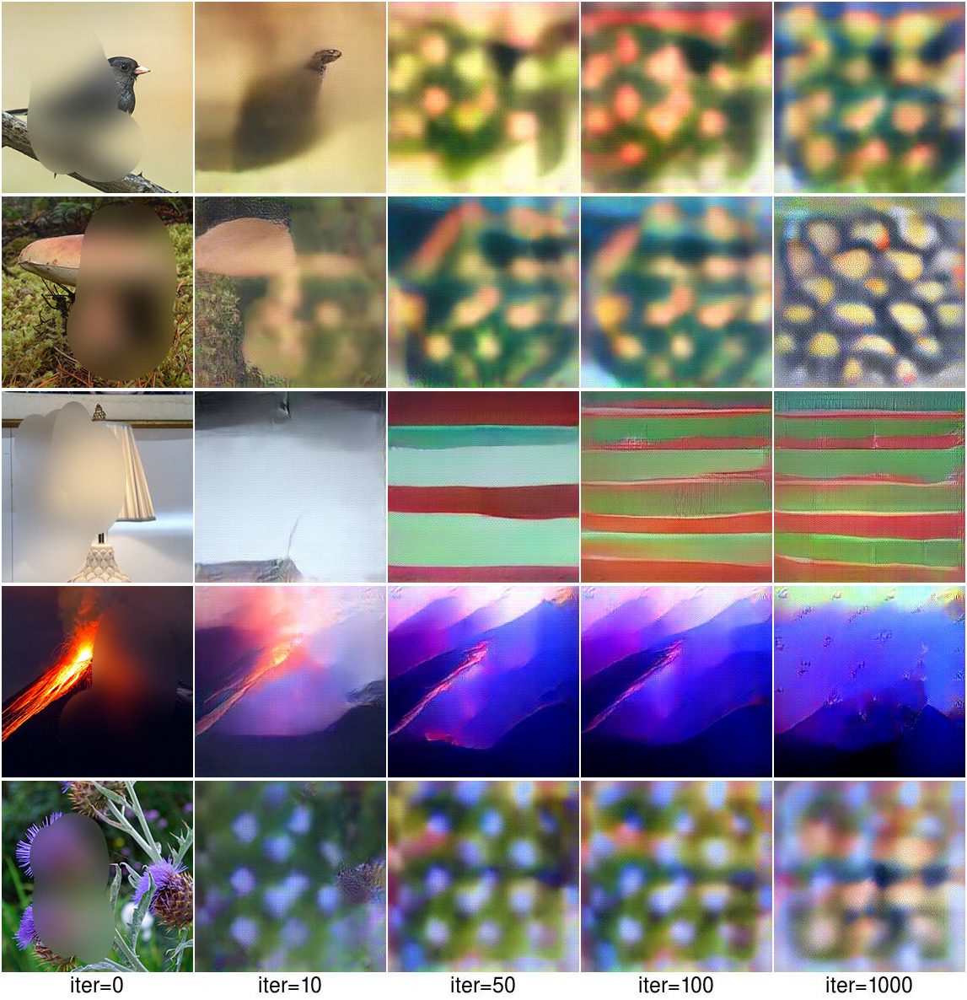
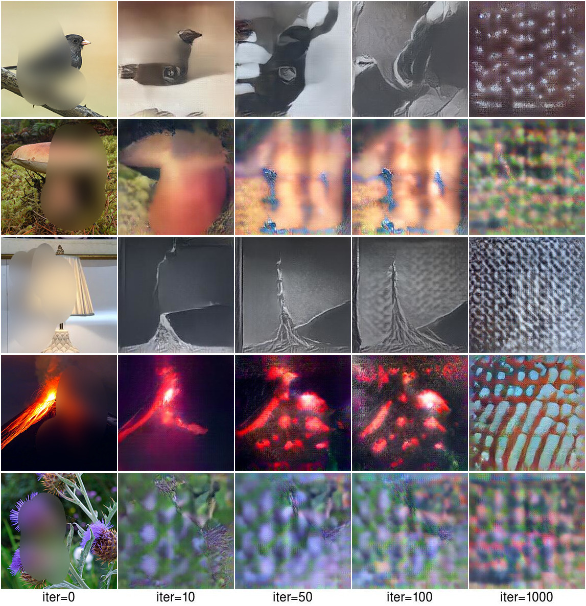
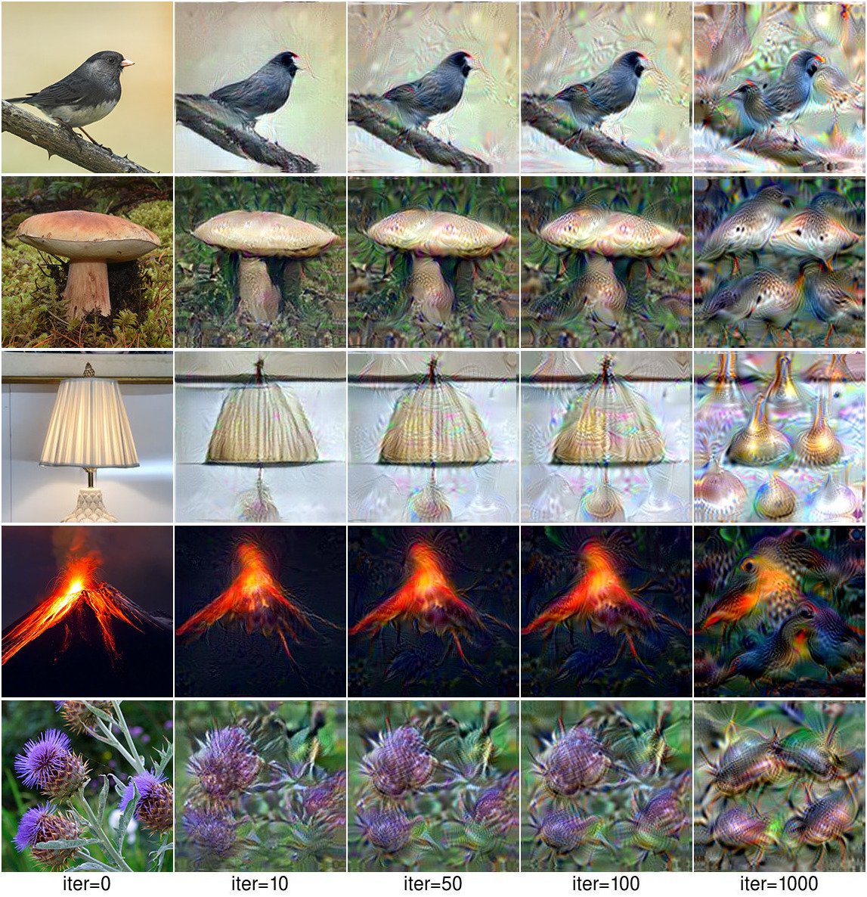

## Modelling Phenomenological Differences in Aetiologically Distinct Visual Hallucinations Using Deep Neural Networks

This repository contains source code necessary to reproduce some of the main results in the paper:

[Suzuki K](https://sites.google.com/view/keisukesuzuki/), David S, [Seth A](https://www.anilseth.com/) ["Modelling Phenomenological Differences in Aetiologically Distinct Visual Hallucinations Using Deep Neural Networks."](https://osf.io/nr4ke/). PsyArXiv [1].

For more information regarding the project, please visit [the project website](https://osf.io/nr4ke/).

## Setup
Our model is largely based on [Nguyen et al 2016](https://arxiv.org/abs/1605.09304)[2]. Please also follow to [the instlation instruction](https://github.com/Evolving-AI-Lab/synthesizing) of the original repository for setting up.

### Installing software
This code is built on top of Caffe. You'll need to install the following:
* Install Caffe; follow the official [installation instructions](http://caffe.berkeleyvision.org/installation.html). You will need to install [Caffe supporting upconvolution](https://github.com/dosovits/caffe-fr-chairs)
* Build the Python bindings for Caffe
* If you have an NVIDIA GPU, you can optionally build Caffe with the GPU option to make it run faster
* Make sure the path to your `caffe/python` folder in [settings.py](settings.py) is correct
* Install [ImageMagick](http://www.imagemagick.org/script/binary-releases.php) command-line interface on your system.

### Downloading models
You will need to download a few models. There are `download.sh` scripts provided for your convenience.
* The image generation network (Upconvolutional network) from [3]. You can download directly on their [website](https://github.com/anguyen8/upconv_release) or using the provided script `cd nets/upconv && ./download.sh`
* A network being visualized (e.g. from Caffe software package or Caffe Model Zoo). The provided examples use these models:
  * [BVLC reference CaffeNet](https://github.com/BVLC/caffe/tree/master/models/bvlc_reference_caffenet): `cd nets/caffenet && ./download.sh`

Settings:
* Paths to the downloaded models are in [settings.py](settings.py). They are relative and should work if the `download.sh` scripts run correctly.
* The paths to the model being visualized can be overriden by providing arguments `net_weights` and `net_definition` to [act_max.py](act_max.py).

## Usage
The main algorithm is in [act_max2.py](act_max2.py), which is a standalone Python script; you can pass various command-line arguments to run different experiments. 

In our model, three different parameters can be modified to simulate different types of visual hallucinations.  

    

### Examples
We provide here four different examples as a starting point. Feel free to be creative and fork away to produce even cooler results!

[1_activate_output.sh](1_activate_output.sh): Optimizing codes to activate *output* neurons of the [CaffeNet DNN](https://github.com/BVLC/caffe/tree/master/models/bvlc_reference_caffenet) trained on ImageNet dataset. This script synthesizes images for 5 example neurons. 
* Running `./1_activate_output.sh` produces this result:

    

[2_activate_output_placesCNN.sh](2_activate_output_placesCNN.sh): Optimizing codes to activate *output* neurons of a different network, here [AlexNet DNN](http://places.csail.mit.edu/) trained on [MIT Places205](http://places.csail.mit.edu/) dataset. The same prior used here produces the best images for AlexNet architecture trained on different datasets. It also works on other architectures but the image quality might degrade (see Sec. 3.3 in [our paper](http://arxiv.org/abs/1605.09304)). 
* Running `./2_activate_output_placesCNN.sh` produces this result:

    

[3_start_from_real_image.sh](3_start_from_real_image.sh): Instead of starting from a random code, this example starts from a code of a real image (here, an image of a red bell pepper) and optimizes it to increase the activation of the "bell pepper" neuron. 
* Depending on the hyperparameter settings, one could produce images near or far the initialization code (e.g. ending up with a *green* pepper when starting with a red pepper).
* The `debug` option in the script is enabled allowing one to visualize the activations of intermediate images.
* Running `./3_start_from_real_image.sh` produces this result:

    

<i>Optimization adds more green leaves and a surface below the initial pepper</i>

[4_activate_hidden.sh](4_activate_hidden.sh): Optimizing codes to activate *hidden* neurons at layer 5 of the [DeepScene DNN](https://github.com/BVLC/caffe/tree/master/models/bvlc_reference_caffenet) trained on MIT Places dataset. This script synthesizes images for 5 example neurons. 
* Running `./4_activate_hidden.sh` produces this result:

    
    

<i>From left to right are units that are semantically labeled by humans in [2] as:  lighthouse, building, bookcase, food, and painting </i>

* This result matches the conclusion that object detectors automatically emerge in a DNN trained to classify images of places [2]. See Fig. 6 in [our paper](http://arxiv.org/abs/1605.09304) for more comparison between these images and visualizations produced by [2].

[5_activate_output_GoogLeNet.sh](5_activate_output_GoogLeNet.sh): Here is an example of activating the output neurons of a different architecture, GoogLeNet, trained on ImageNet. Note that the *learning rate* used in this example is different from that in the example 1 and 2 above.
* Running `./5_activate_output_GoogLeNet.sh` produces this result:

    

## Licenses
Note that the code in this repository is licensed under MIT License, but, the pre-trained models used by the code have their own licenses. Please carefully check them before use.
* The [image generator networks](https://arxiv.org/abs/1602.02644) (in [nets/upconv/](nets/upconv)) are for non-commercial use only. See their [page](http://lmb.informatik.uni-freiburg.de/resources/software.php) for more.
* See the licenses of the models that you visualize (e.g. [DeepScene CNN](https://people.csail.mit.edu/khosla/papers/iclr2015_zhou.pdf)) before use.

## References

[1] Suzuki K, Roseboom W, Schwartzman DJ, Seth A. "A deep-dream virtual reality platform for studying altered perceptual phenomenology"Scientific reports 7 (1), 1-11. 2017.

[2] Nguyen A, Dosovitskiy A, Yosinski J, Brox T, Clune J. "Synthesizing the preferred inputs for neurons in neural networks via deep generator networks. In Advances in neural information processing systems, pages 3387–3395. 2016.

[3] Dosovitskiy A, Brox T. "Generating images with perceptual similarity metrics based on deep networks". arXiv preprint arXiv:1602.02644. 2016
 