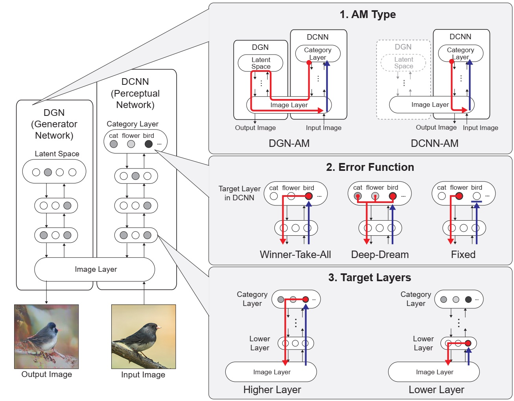
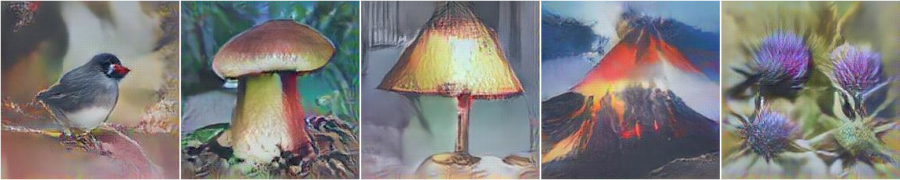
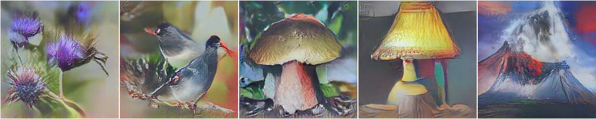
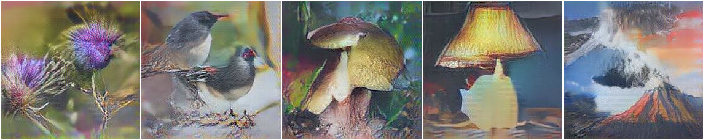
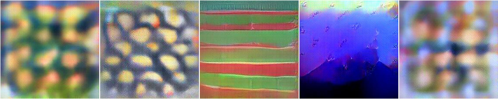
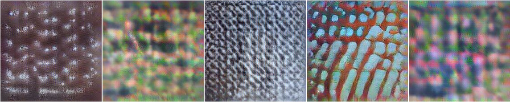
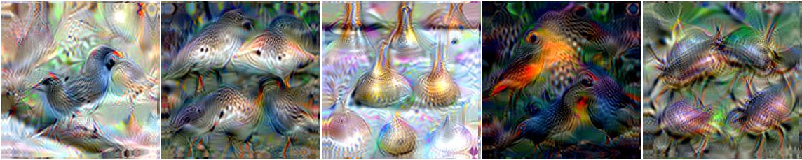
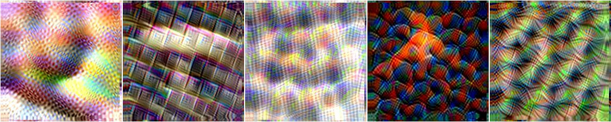
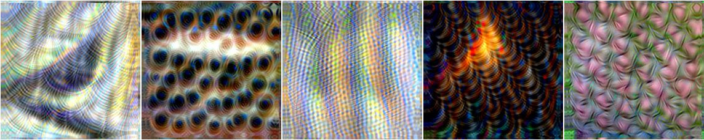

## Modelling Phenomenological Differences in Aetiologically Distinct Visual Hallucinations Using Deep Neural Networks

This repository contains source code necessary to reproduce some of the main results in the paper:

[Suzuki K](https://sites.google.com/view/keisukesuzuki/), David S, [Seth A](https://www.anilseth.com/) ["Modelling Phenomenological Differences in Aetiologically Distinct Visual Hallucinations Using Deep Neural Networks."](https://osf.io/nr4ke/). PsyArXiv [1].

For more information regarding the project, please visit [the project website on OSF](https://osf.io/nr4ke/).

## Setup
Our model is largely based on [Nguyen et al 2016](https://arxiv.org/abs/1605.09304)[2]. Please also follow [the instlation instruction](https://github.com/Evolving-AI-Lab/synthesizing) of the original repository for setting up the model.

### Installing software
This code is built on top of Caffe. You'll need to install the following:
* Install Caffe; follow the official [installation instructions](http://caffe.berkeleyvision.org/installation.html). You will need to install [Caffe supporting upconvolution](https://github.com/dosovits/caffe-fr-chairs)
* Build the Python bindings for Caffe
* If you have an NVIDIA GPU, you can optionally build Caffe with the GPU option to make it run faster
* Make sure the path to your `caffe/python` folder in [settings.py](settings.py) is correct
* Install [ImageMagick](http://www.imagemagick.org/script/binary-releases.php) command-line interface on your system.

### Downloading models
You will need to download a few models. There are `download.sh` scripts provided for your convenience.
* The deep generator network (Upconvolutional network) from [Dosovitskiy & Brox (2016)](https://arxiv.org/abs/1602.02644)[3]. You can download directly on their [website](https://github.com/anguyen8/upconv_release) or using the provided script `cd nets/upconv && ./download.sh`
* The deep convolutional neural network can be downloaded from [BVLC reference CaffeNet](https://github.com/BVLC/caffe/tree/master/models/bvlc_reference_caffenet) or using the provided script `cd nets/caffenet && ./download.sh`

Settings:
* Paths to the downloaded models are in [settings.py](settings.py). They are relative and should work if the `download.sh` scripts run correctly.

## Usage
The main algorithm is in [act_max2.py](act_max2.py), which is a standalone Python script; you can pass various command-line arguments to run different experiments. 

In our model, three different parameters can be modified to simulate different types of visual hallucinations.  

    

Model architecture and 3 manipulations applied to our model to simulate specific hallucinatory phenomenology

### Manipulating Parameters 

All the script calls [image_generation.sh](image_generation.sh) which handles the parameters before calling [act_max2.py](act_max2.py). 

Key parameters in [image_generation.sh](image_generation.sh) are as follows. These variables can be spcified with commanline arguments. Check out [run_experiment.sh](run_validation.sh).

#### Target Layer `act_layer="${1:-fc8}"` [fc8 (default)| conv3 | conv4 | conv5]

Specify the target layer in DCNN to terminate the activation maximisation.

#### Generation Type `gen_type="${2:-DGN}"` [DGN (default) | DCNN]

Specifiy the type of activation maximisation. Both DGN and DCNN are used with the `DGN` actvation maximisation, wheras only DCNN is used with the `DCNN` actvation maximisation

#### Error Function `act_mode="${3:-winner}"` [winner (default), l2norm, fixed]

Specify the error function. `winner`: Winner-take-all error functin, `l2norm`: Deep-dream error functin, `fixed`: Fixed error functin. 

#### Initial images `init_img="${4:-original}"` [original (default) | blurred]

Specify the input images. `blurred` is for simulating the CBS hallucinations. `original` should be used otherwise.

#### Target categories `target_cat="${5:-original}"` [original (default) | shifted]: 

Specify the target categories for for `fixed` Error Function. This value is ignored in `winner` or `l2norm` error functions.

#### Export images `export="${6:-0}"` [0 (default) | 1]

If `export` is `1`, the program exports images to `export` folder at certain nubmer of itterations defined 'export_mode'.

#### Export modes `export_mode="${7:-exp}"` [exp | validation | interview]

Exporting the images at iteration 10, 50, 100, and 1000 in `exp` mode, 50, 100, and 100 in `validation` mode, and 5, 10, 50, 100, 200, 400, 600, 800, and 1000 in `interview` mode.

### Simulations
We provide here six different simulations provided in the paper. 

#### [1_veridical_perception.sh](1_veridical_perception.sh)

Simulating benchmark (non-hallucinatory) perceptual phenomenology using `act_layer=fc8` `gen_type=DGN` `act_mode=winner`. Using 'Winner-take-all' error function, the images with the categories in the input images are synthesised. See Sec.3.1 in [our paper](PsyArXiv) for more details. 

* Running `./1_veridical_perception.sh` produces this result:

    

* The `debug` option in the script is enabled allowing one to visualize the activations of intermediate images.

#### [2_complex_neurological.sh](2_complex_neurological.sh)

Simulating phenomenology of complex neurological visual hallucinations using `act_layer=fc8` `gen_type=DGN` `act_mode=fixed`. Using `fixed` error function, the image with different categories from the input images are synthesised. See Sec.3.2 in [our paper](PsyArXiv) for more details. 

* Running `./2_complex_neurological.sh` produces this result:

    

#### [3_complex_CBS.sh](3_complex_CBS.sh)

Simulating visual hallucinations as the result of visuall loss in Charls Bonnet Syndrome (CBS) using `act_layer=fc8` `gen_type=DGN` `act_mode=fixed` `init_img=blurred`. The input images with blurs in their centres are used to simulte visual deficits associated with CBS. see Sec.3.3 in [our paper](PsyArXiv).

* Running `./3_complex_CBS.sh` produces this result:

    

<i>Optimization adds more green leaves and a surface below the initial pepper</i>

[4_simple_CBS.sh](4_simple_CBS.sh): Optimizing codes to activate *hidden* neurons at layer 5 of the [DeepScene DNN](https://github.com/BVLC/caffe/tree/master/models/bvlc_reference_caffenet) trained on MIT Places dataset. This script synthesizes images for 5 example neurons. 
* Running `./4_activate_hidden.sh` produces this result:

    
    

<i>From left to right are units that are semantically labeled by humans in [2] as:  lighthouse, building, bookcase, food, and painting </i>

* This result matches the conclusion that object detectors automatically emerge in a DNN trained to classify images of places [2]. See Fig. 6 in [our paper](http://arxiv.org/abs/1605.09304) for more comparison between these images and visualizations produced by [2].

[5_complex_psychedelic.sh](5_complex_psychedelic.sh): Here is an example of activating the output neurons of a different architecture, GoogLeNet, trained on ImageNet. Note that the *learning rate* used in this example is different from that in the example 1 and 2 above.
* Running `./5_activate_output_GoogLeNet.sh` produces this result:

    

[6_simple_psychedelic.sh](6_simple_psychedelic.sh): Here we simualte the simple psychedelic VHs with the following parameters.

    
    
    

### Experiments

#### [run_experiment.sh](run_validation.sh): Run all the above and generate the images in `Result` folder.

An example for verdical perception with the time course.

    

### Validations

[run_validation.sh](run_validation.sh): Run all the conditions with 32 different initial images, which were used for psychedelic survey (see the paper[1] for details).

## Licenses
Note that the code in this repository is licensed under MIT License, but, the pre-trained models used by the code have their own licenses. Please carefully check them before use.
* The [image generator networks](https://arxiv.org/abs/1602.02644) (in [nets/upconv/](nets/upconv)) are for non-commercial use only. See their [page](http://lmb.informatik.uni-freiburg.de/resources/software.php) for more.

## References

[1] Suzuki K, Roseboom W, Schwartzman DJ, Seth A. "A deep-dream virtual reality platform for studying altered perceptual phenomenology"Scientific reports 7 (1), 1-11. 2017.

[2] Nguyen A, Dosovitskiy A, Yosinski J, Brox T, Clune J. "Synthesizing the preferred inputs for neurons in neural networks via deep generator networks. In Advances in neural information processing systems, pages 3387–3395. 2016.

[3] Dosovitskiy A, Brox T. "Generating images with perceptual similarity metrics based on deep networks". arXiv preprint arXiv:1602.02644. 2016
 